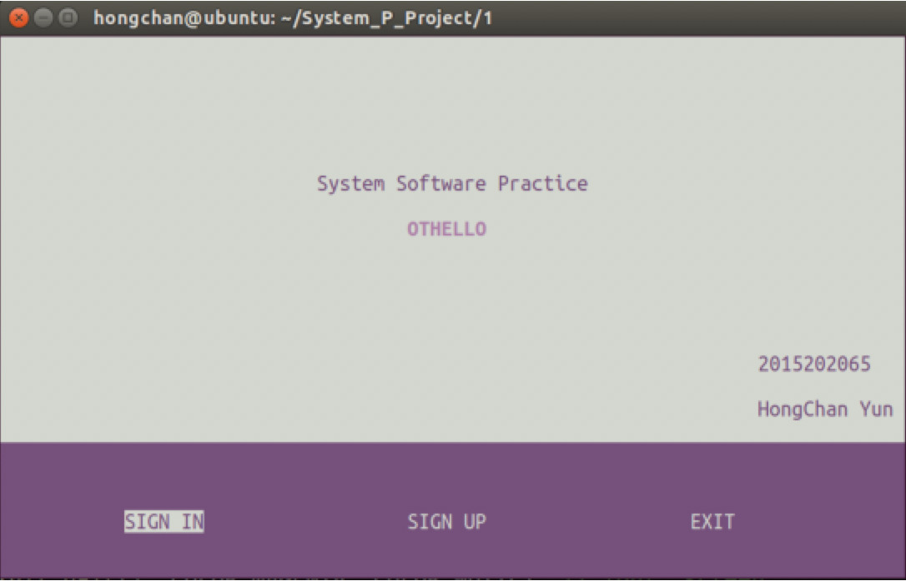

## Othello Game (오델로 게임)

&nbsp;&nbsp;&nbsp;&nbsp;&nbsp;&nbsp;&nbsp;&nbsp;&nbsp;&nbsp;&nbsp;&nbsp;&nbsp;&nbsp;&nbsp;&nbsp;&nbsp;&nbsp;&nbsp;&nbsp;&nbsp;&nbsp;&nbsp;&nbsp;&nbsp;&nbsp;&nbsp;&nbsp;&nbsp;&nbsp;&nbsp;&nbsp;&nbsp;&nbsp;&nbsp;&nbsp;&nbsp;&nbsp;&nbsp;&nbsp;&nbsp;&nbsp;&nbsp;&nbsp;&nbsp;&nbsp;&nbsp;&nbsp;&nbsp;&nbsp;&nbsp;&nbsp;&nbsp;&nbsp;&nbsp;&nbsp;&nbsp;&nbsp;&nbsp;&nbsp;*2018-2 시스템소프트웨어실습 프로젝트*

**프로세스간 소켓 통신을 사용해 오델로 게임 구현 (서버 - 클라이언트 모델)**

 

- **구현한 기능 소개**
  - 회원가입 및 탈퇴
  - 로그인 및 로그아웃
  - 회원 정보 확인 (게임 전적 확인)
  - 게임

 

- **사용한 도구 및 라이브러리**
  + ncurses  (GUI 라이브러리)
  + Unix System Call
  + Visual Studio Code

 

+ **개발 환경**
  + Ubuntu Linux 16.04

 

- **스크린샷**

  </img>

---

> 2019.7.13 최종 업데이트
>
> 광운대학교 소프트웨어학부 윤홍찬

